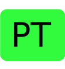

# Badges
Badges are little identificators to let you know more about a specific YouTuber. 0 or more badges can be attached to a YouTuber. These badges only serve as extra information for you while navigating through this list.

 

#### Verified YouTube Channel
This badge is attached to the YouTubers that have a verified symbol on their channel. Learn more about verified YouTube channels [here](https://support.google.com/youtube/answer/3046484?hl=en).

 

#### Weekly video upload
This badge is attached to the YouTubers who upload at least 1 video per week.

 

#### English speaking YouTubers
This badge is attached to YouTubers that make their content in English.

 

#### French speaking YouTubers
This badge is attached to YouTubers that make their content in French.

 

#### Spanish speaking YouTubers
This badge is attached to YouTubers that make their content in Spanish.

 

#### Portuguese speaking YouTubers
This badge is attached to YouTubers that make their content in Portuguese.
